<div align="center">


<br/>

[](https://github.com/hammadxcm)
[](https://twitter.com/hammadkhanxcm)
[](https://linkedin.com/in/hammadxcm)

</div>

---

## 🎯 About Me

```javascript
const hammadKhan = {
    title: "Senior Full Stack Engineer",
    experience: "8+ years building systems at scale",
    location: "Lahore, Pakistan 🇵🇰",
    specialization: "Distributed Systems & Platform Architecture",
    currentRole: "Senior Full Stack Engineer @ NexaQuanta",
    workStyle: "Technical Leadership & Full-stack Development",

    expertise: {
        systemDesign: ["Microservices", "Event-Driven Architecture", "Domain-Driven Design"],
        backend: ["Ruby on Rails", "NestJS", "NodeJS", "GraphQL", "High-Performance APIs"],
        frontend: ["ReactJS", "VueJS", "NextJS", "Progressive Web Apps"],
        infrastructure: ["AWS", "Azure", "Docker", "Redis", "BullMQ", "Kubernetes"],
        databases: ["PostgreSQL", "MongoDB", "MySQL", "Prisma ORM", "Data Modeling"],
        integrations: ["Multi-API Platforms", "CRM Systems", "Payment Gateways", "CitNOW"],
        security: ["OWASP Top 10", "Audit Systems", "Injection Prevention", "HIPAA"]
    },

    technicalLeadership: [
        "Delivered 115+ MRs in 5 months at NexaQuanta",
        "Designed fault-tolerant systems handling millions of requests",
        "Led migration of monolithic apps to microservices architecture",
        "Mentored engineering teams on system design and best practices",
        "Established engineering standards and code review processes"
    ],

    systemsBuilt: [
        "Enterprise appointment lifecycle with cross-module linking (60+ MRs)",
        "Multi-dealer org scoping with dual-database architecture",
        "CSV data import pipelines with batch optimization & duplicate detection",
        "Generic audit module for compliance and forensic traceability",
        "Real-time data processing pipelines with 95% job success rate",
        "Progressive loading systems reducing page load by 70%",
        "Zero-downtime Stripe API migration with 99.9% uptime"
    ],

    openSource: [
        "Rails Core Contributor — merged PR to rails/rails",
        "daemon-os — macOS MCP server for AI agent computer-use",
        "rubocop-hk — 2,800+ downloads on RubyGems",
        "ramadan-cli-pro — TUI dashboard with prayer times & i18n"
    ],

    currentFocus: "Platform Engineering & Technical Strategy",
    openTo: ["Staff/Principal Engineering Roles", "Architecture Consulting", "Team Leadership"],
    philosophy: "Building systems that scale, teams that deliver, and solutions that last 🚀"
};
```

---

## 🛠️ Professional Tech Arsenal

<div align="center">

### 🎯 Core Expertise
<div align="center">
<table style="border-spacing: 10px;">
<tr>
<td align="center" width="100">
<a href="https://www.ruby-lang.org/" target="_blank" rel="noreferrer">

<br><strong>Ruby</strong>
<br><sub>⭐⭐⭐⭐⭐</sub>
</a>
</td>
<td align="center" width="100">
<a href="https://rubyonrails.org/" target="_blank" rel="noreferrer">

<br><strong>Rails</strong>
<br><sub>⭐⭐⭐⭐⭐</sub>
</a>
</td>
<td align="center" width="100">
<a href="https://reactjs.org/" target="_blank" rel="noreferrer">

<br><strong>ReactJS</strong>
<br><sub>⭐⭐⭐⭐</sub>
</a>
</td>
<td align="center" width="100">
<a href="https://vuejs.org/" target="_blank" rel="noreferrer">

<br><strong>VueJS</strong>
<br><sub>⭐⭐⭐⭐</sub>
</a>
</td>
<td align="center" width="100">
<a href="https://graphql.org/" target="_blank" rel="noreferrer">

<br><strong>GraphQL</strong>
<br><sub>⭐⭐⭐⭐⭐</sub>
</a>
</td>
<td align="center" width="100">
<a href="https://nextjs.org/" target="_blank" rel="noreferrer">

<br><strong>NextJS</strong>
<br><sub>⭐⭐⭐⭐</sub>
</a>
</td>
<td align="center" width="100">
<a href="https://www.python.org/" target="_blank" rel="noreferrer">

<br><strong>Python</strong>
<br><sub>⭐⭐⭐</sub>
</a>
</tr>
</table>
</div>

### 🚀 Frontend Development
<div align="center">
<table style="border-spacing: 8px;">
<tr>
<td align="center" width="90">
<a href="https://developer.mozilla.org/en-US/docs/Web/JavaScript" target="_blank" rel="noreferrer">

<br><sub><b>JavaScript</b></sub>
</a>
</td>
<td align="center" width="90">
<a href="https://www.typescriptlang.org/" target="_blank" rel="noreferrer">

<br><sub><b>TypeScript</b></sub>
</a>
</td>
<td align="center" width="90">
<a href="https://developer.mozilla.org/en-US/docs/Web/HTML" target="_blank" rel="noreferrer">

<br><sub><b>HTML5</b></sub>
</a>
</td>
<td align="center" width="90">
<a href="https://developer.mozilla.org/en-US/docs/Web/CSS" target="_blank" rel="noreferrer">

<br><sub><b>CSS3</b></sub>
</a>
</td>
<td align="center" width="90">
<a href="https://tailwindcss.com/" target="_blank" rel="noreferrer">

<br><sub><b>Tailwind</b></sub>
</a>
</td>
<td align="center" width="90">

<br><sub><b>SASS</b></sub>
</td>
<td align="center" width="90">

<br><sub><b>Redux</b></sub>
</td>
<td align="center" width="90">

<br><sub><b>Chrome Ext</b></sub>
</td>
</tr>
<tr>
<td align="center" width="90">

<br><sub><b>Webpack</b></sub>
</td>
<td align="center" width="90">

<br><sub><b>Gatsby</b></sub>
</td>
<td align="center" width="90">

<br><sub><b>Storybook</b></sub>
</td>
</tr>
</table>
</div>

### ⚙️ Backend & APIs
<div align="center">
<table style="border-spacing: 8px;">
<tr>
<td align="center" width="90">
<a href="https://nodejs.org/" target="_blank" rel="noreferrer">

<br><sub><b>NodeJS</b></sub>
</a>
</td>
<td align="center" width="90">
<a href="https://graphql-ruby.org/" target="_blank" rel="noreferrer">

<br><sub><b>GraphQL</b></sub>
</a>
</td>
<td align="center" width="90">
<a href="https://developer.salesforce.com/" target="_blank" rel="noreferrer">

<br><sub><b>Salesforce</b></sub>
</a>
</td>
<td align="center" width="90">
<a href="https://developers.hubspot.com/" target="_blank" rel="noreferrer">

<br><sub><b>HubSpot</b></sub>
</a>
</td>
<td align="center" width="90">
<a href="https://stripe.com/docs/api" target="_blank" rel="noreferrer">

<br><sub><b>Stripe</b></sub>
</a>
</td>
<td align="center" width="90">
<a href="https://marketodevdocs.adobe.com/" target="_blank" rel="noreferrer">

<br><sub><b>Marketo</b></sub>
</a>
</td>
</tr>
<tr>
<td align="center" width="90">

<br><sub><b>REST API</b></sub>
</td>
<td align="center" width="90">

<br><sub><b>Django</b></sub>
</td>
<td align="center" width="90">

<br><sub><b>Java</b></sub>
</td>
<td align="center" width="90">

<br><sub><b>Nginx</b></sub>
</td>
</tr>
</table>
</div>

### 🗄️ Databases & Storage
<div align="center">
<table style="border-spacing: 8px;">
<tr>
<td align="center" width="100">
<a href="https://www.postgresql.org/" target="_blank" rel="noreferrer">

<br><sub>PostgreSQL</sub>
</a>
</td>
<td align="center" width="100">
<a href="https://www.mongodb.com/" target="_blank" rel="noreferrer">

<br><sub>MongoDB</sub>
</a>
</td>
<td align="center" width="100">
<a href="https://www.mysql.com/" target="_blank" rel="noreferrer">

<br><sub>MySQL</sub>
</a>
</td>
<td align="center" width="100">
<a href="https://redis.io/" target="_blank" rel="noreferrer">

<br><sub>Redis</sub>
</a>
</td>
<td align="center" width="100">
<a href="https://www.sqlite.org/" target="_blank" rel="noreferrer">

<br><sub>SQLite</sub>
</a>
</td>
</tr>
</table>
</div>

### ☁️ Cloud & DevOps
<div align="center">
<table style="border-spacing: 8px;">
<tr>
<td align="center" width="90">
<a href="https://aws.amazon.com/" target="_blank" rel="noreferrer">

<br><sub><b>AWS</b></sub>
</a>
</td>
<td align="center" width="90">
<a href="https://azure.microsoft.com/" target="_blank" rel="noreferrer">

<br><sub><b>Azure</b></sub>
</a>
</td>
<td align="center" width="90">
<a href="https://git-scm.com/" target="_blank" rel="noreferrer">

<br><sub><b>Git</b></sub>
</a>
</td>
<td align="center" width="90">
<a href="https://github.com/" target="_blank" rel="noreferrer">

<br><sub><b>GitHub</b></sub>
</a>
</td>
<td align="center" width="90">

<br><sub><b>S3/EC2</b></sub>
</td>
<td align="center" width="90">

<br><sub><b>Sidekiq</b></sub>
</td>
<td align="center" width="90">

<br><sub><b>Docker</b></sub>
</td>
<td align="center" width="90">

<br><sub><b>Heroku</b></sub>
</td>
</tr>
<tr>
<td align="center" width="90">

<br><sub><b>Kubernetes</b></sub>
</td>
</tr>
</table>
</div>

### 🧪 Testing & Quality
<div align="center">
<table style="border-spacing: 8px;">
<tr>
<td align="center" width="100">

<br><sub><b>RSpec</b></sub>
</td>
<td align="center" width="100">

<br><sub><b>FactoryBot</b></sub>
</td>
<td align="center" width="100">

<br><sub><b>Shoulda</b></sub>
</td>
<td align="center" width="100">

<br><sub><b>Vue Test Utils</b></sub>
</td>
<td align="center" width="100">

<br><sub><b>Vitest</b></sub>
</td>
<td align="center" width="100">

<br><sub><b>Jest</b></sub>
</td>
</tr>
<tr>
<td align="center" width="100">

<br><sub><b>ESLint</b></sub>
</td>
<td align="center" width="100">

<br><sub><b>Prettier</b></sub>
</td>
<td align="center" width="100">

<br><sub><b>Testing Lib</b></sub>
</td>
</tr>
</table>
</div>

### 🤖 AI & Modern Tools
<div align="center">
<table style="border-spacing: 8px;">
<tr>
<td align="center" width="100">

<br><sub><b>ChatGPT</b></sub>
</td>
<td align="center" width="100">

<br><sub><b>Claude AI</b></sub>
</td>
<td align="center" width="100">

<br><sub><b>GitHub Copilot</b></sub>
</td>
<td align="center" width="100">

<br><sub><b>Midjourney</b></sub>
</td>
</tr>
</table>
</div>

### 🔧 Additional Languages & Tools
<div align="center">
<table style="border-spacing: 8px;">
<tr>
<td align="center" width="90">

<br><sub><b>C++</b></sub>
</td>
<td align="center" width="90">

<br><sub><b>C#</b></sub>
</td>
<td align="center" width="90">

<br><sub><b>Swift</b></sub>
</td>
<td align="center" width="90">

<br><sub><b>ReScript</b></sub>
</td>
<td align="center" width="90">

<br><sub><b>Raspberry Pi</b></sub>
</td>
<td align="center" width="90">

<br><sub><b>REST API</b></sub>
</td>
<td align="center" width="90">

<br><sub><b>Docker</b></sub>
</td>
<td align="center" width="90">

<br><sub><b>GitHub</b></sub>
</td>
</tr>
</table>
</div>

### 💻 IDEs & Development Environment
<div align="center">
<table style="border-spacing: 8px;">
<tr>
<td align="center" width="90">

<br><sub><b>VS Code</b></sub>
</td>
<td align="center" width="90">

<br><sub><b>IntelliJ</b></sub>
</td>
<td align="center" width="90">

<br><sub><b>WebStorm</b></sub>
</td>
<td align="center" width="90">

<br><sub><b>RubyMine</b></sub>
</td>
<td align="center" width="90">

<br><sub><b>PyCharm</b></sub>
</td>
<td align="center" width="90">

<br><sub><b>PhpStorm</b></sub>
</td>
<td align="center" width="90">

<br><sub><b>RustRover</b></sub>
</td>
</tr>
</table>
</div>

</div>

---

## 💼 Professional Journey & Achievements

<div align="center">

### 🎯 Current Role
<table>
<tr>
<td align="center">

<br/>
<sub><b>Since October 2025 • Remote (London, UK)</b></sub>
</td>
</tr>
</table>

### 🏢 Professional Experience & System Architecture

<div align="center">

---

<table>
<tr>
<td width="150">

<br/><br/>
<a href="https://nexaquanta.ai/" target="_blank">

</a>
</td>
<td width="600">
<h3>🚀 Senior Full Stack Engineer @ <a href="https://nexaquanta.ai/" target="_blank">NexaQuanta</a></h3>
<p><em>Full-time • Remote (London, UK)</em></p>

**Full-Stack Development & Platform Engineering:**

📊 **CRM & Product Reporting System**
- **Challenge**: Lack of centralized reporting capability for business intelligence
- **Solution**: Built comprehensive reporting module with email-based delivery supporting CRM and Product analytics
- **Impact**: Enabled self-service reporting for sales and operations teams, improved business visibility into customer interactions and pipeline metrics

🗄️ **Enterprise Database Schema Migration**
- **Challenge**: Incomplete database schema limiting cross-system data integration
- **Solution**: Designed and executed complete database schema migration achieving 100% parity with source system
- **Impact**: Enabled complete dealer hierarchy tracking, unified data management, established foundation for real-time synchronization and business intelligence

🗓️ **Aftersales Appointments Management System**
- **Challenge**: No centralized appointment management for aftersales workflows — advisors had no way to create, track, or link appointments across HCI, Payment, and Triage modules
- **Solution**: Built a complete appointment lifecycle module with multi-step creation forms, fly-out detail panels, status tags, advanced filtering/sorting, cross-module linking, and re-assignable "Assigned To" fields backed by SSO user lookup
- **Impact**: Enabled full aftersales workflow management for dealer groups, appointment linking across HCI/Payment/Triage, real-time status tracking, and 60+ merged MRs delivering the feature end-to-end

📹 **CitNOW Video Library & Status Integration**
- **Challenge**: No visibility into video status (Sales & Workshop) within the dealer portal — advisors had to switch between systems to track video progress
- **Solution**: Built a dedicated video library page with filtering/sorting by status, CitNOW Sales and Workshop integration, NGD URL generation for direct video access, isolated filter state between Aftersales and Sales pages, and mobile-responsive design matching Figma specs
- **Impact**: Unified video management across Sales and Aftersales in a single portal, eliminated context-switching between systems, real-time video status visibility for all advisors

📥 **Enterprise Data Import Pipeline (IC5 → IC4)**
- **Challenge**: No mechanism to migrate legacy IC5 customer and appointment data into the new portal — manual entry was infeasible at scale
- **Solution**: Built a full CSV-based data import pipeline with upload UI, server-side validation, duplicate detection (email uniqueness enforcement), appointment status mapping, import summary with invalid/valid record breakdown, and performance-optimized batch processing
- **Impact**: Enabled seamless migration of enterprise customer and appointment datasets, prevented duplicate records with global uniqueness enforcement, reduced import processing time significantly with batch optimization

🏢 **Multi-Dealer Org Scoping & Dual-Database Architecture**
- **Challenge**: Portal lacked proper dealer/org scoping — queries returned data across all organizations without isolation, creating data leakage risk in multi-dealer environments
- **Solution**: Integrated `orgId` throughout the portal with comprehensive dealer scoping for all IC4/IC5 lookup queries, dual-database querying strategy for cross-system appointment resolution, and dealer hierarchy tracking
- **Impact**: Proper data isolation per dealer organization, eliminated cross-org data leakage, established foundation for scalable multi-tenant dealer group management

🔒 **Security Hardening & Generic Audit Module**
- **Challenge**: Critical query injection vulnerability identified by Aikido security scan in the presenter service; no audit trail for user actions across the platform
- **Solution**: Patched the injection vulnerability in the presenter microservice; architected and implemented a generic audit module with activity tracking refactor, reusable across all platform entities
- **Impact**: Eliminated critical security vulnerability (CVE-level), established comprehensive audit trail for compliance and forensic traceability across all user actions

⚙️ **Redis Cluster & Infrastructure Hardening**
- **Challenge**: Redis Cluster CROSSSLOT errors crashing BullMQ job queues; optional auth not handled
- **Solution**: Fixed CROSSSLOT key violations for BullMQ sso-import queue, added graceful Redis authentication handling
- **Impact**: Stable job processing in clustered Redis environments, zero queue failures from infrastructure misconfig

**Technologies**: `Microservices` `NestJS` `Node.js` `React.js` `Next.js` `MongoDB` `PostgreSQL` `Prisma ORM` `AWS` `Amazon EC2` `Amazon S3` `Redis` `BullMQ` `API Development` `Jest` `Vitest`

</td>
</tr>
</table>

---

<table>
<tr>
<td width="150">

<br/><br/>
<a href="https://www.linkedin.com/company/techxmation/about/" target="_blank">

</a>
</td>
<td width="600">
<h3>🚀 Staff Software Engineer @ <a href="https://www.linkedin.com/company/techxmation/about/" target="_blank">TechXMation</a></h3>
<p><em>Freelance • Lahore, Pakistan</em></p>

**System Design & Architecture Leadership:**

🏗️ **Distributed Data Processing Architecture**
- **Challenge**: Time-consuming manual data exports causing operational bottlenecks
- **Solution**: Designed and implemented event-driven export system with real-time progress tracking
- **Architecture**: Built pub/sub mechanism using Redis streams with job queuing system
- **Impact**: Reduced export wait times from 30+ minutes to under 5 minutes for large datasets

⚡ **Progressive Loading System Design**
- **Challenge**: Database queries causing 10+ second page load times
- **Solution**: Architected progressive data loading with ReactJS and asynchronous rendering
- **Technical Approach**: Implemented lazy loading with pagination, caching layer using Redis
- **Impact**: Reduced initial page load from 12s to 2.3s, improved user engagement by 70%

🔄 **Multi-Level Job Processing Architecture**
- **Challenge**: Sidekiq job failures, memory overflow, and deployment interruptions
- **Solution**: Designed complex multi-level batch processing with callback mechanisms
- **Technical Implementation**: Created job monitoring system with retry logic and error handling
- **Impact**: Improved job success rate from 60% to 95%, reduced memory usage by 40%

🌉 **Microservices Integration & Data Flow**
- **Challenge**: Poor communication between Pretzel and Fawkes systems causing data inconsistency
- **Solution**: Designed service mesh architecture with message queuing and event sourcing
- **Implementation**: Built central data mapping service for YouTube/TikTok data with comprehensive API documentation
- **Result**: Eliminated 90% of data duplicates, improved system reliability

**Technologies**: `Ruby on Rails` `ReactJS` `Redis` `Sidekiq` `AWS S3` `PostgreSQL` `Microservices` `Event-Driven Architecture`

</td>
</tr>
</table>

---

<table>
<tr>
<td width="150">

<br/><br/>
<a href="https://www.machinetools.com/en" target="_blank">

</a>
</td>
<td width="600">
<h3>🔧 Application Developer @ <a href="https://www.machinetools.com/en" target="_blank">Machine Tools</a></h3>
<p><em>Full-time • Lahore, Pakistan</em></p>

**Database Architecture & Performance Engineering:**

🔍 **Search Engine Optimization**
- **Challenge**: Slow database queries affecting user experience
- **Solution**: Implemented Sphinx Search with optimized indexing strategy
- **Technical Approach**: Designed full-text search with Arel SQL for complex query optimization
- **Impact**: Improved search response time by 300%, enhanced data retrieval efficiency

📊 **Advanced Data Filtering System**
- **Technical Implementation**: Built sophisticated filtering mechanism with role-based access control
- **Architecture**: Designed permission system with hierarchical user roles and content visibility
- **Performance**: Optimized SQL queries resulting in 85% faster data filtering

🎛️ **Email Delivery System Enhancement**
- **System Design**: Architected scalable email delivery system with formatting improvements
- **Technical Features**: Implemented template system with user engagement tracking
- **Result**: Improved email delivery rate by 25% and user engagement metrics

**Technologies**: `Ruby on Rails` `Sphinx Search` `Arel SQL` `PostgreSQL` `Role-Based Access Control`

</td>
</tr>
</table>

---

<table>
<tr>
<td width="150">

<br/><br/>
<a href="https://www.linkedin.com/in/hammadxcm/" target="_blank">

</a>
</td>
<td width="600">
<h3>💻 Senior Software Engineer @ <a href="https://www.linkedin.com/in/hammadxcm/" target="_blank">Freelance</a></h3>
<p><em>Remote • Lahore, Pakistan</em></p>

**Security Architecture & API Design:**

🔐 **API Security Framework**
- **Challenge**: Ensure integrity and authenticity of API communications
- **Solution**: Designed robust API signature verification system
- **Implementation**: Built HMAC-based authentication with JWT tokens and rate limiting
- **Security Features**: Implemented request signing, timestamp validation, and replay attack prevention

🏗️ **Component-Based Architecture**
- **Technical Approach**: Designed reusable ReactJS components with maintainable architecture
- **System Design**: Created modular component library with proper state management
- **Impact**: Reduced development time by 40% through component reusability

🔄 **Multi-Platform API Integration**
- **Architecture**: Built unified API integration layer supporting multiple third-party services
- **Technologies**: Designed adapter pattern for seamless API switching and error handling
- **Result**: Streamlined integration process across different platforms

**Technologies**: `Ruby on Rails` `ReactJS` `GraphQL` `API Security` `Chrome Extensions` `JWT Authentication`

</td>
</tr>
</table>

---

<table>
<tr>
<td width="150">

<br/><br/>
<a href="https://www.sendoso.com/" target="_blank">

</a>
</td>
<td width="600">
<h3>🚀 Software Engineer @ <a href="https://www.sendoso.com/" target="_blank">Sendoso</a></h3>
<p><em>Full-time • Lahore, Pakistan • 4 Years</em></p>

**Enterprise-Scale System Architecture & Platform Engineering:**

🏛️ **Multi-API Integration Platform**
- **System Design**: Architected unified integration platform supporting 10+ APIs (Kolide, Microsoft Azure, Kandji, Render, Secure Frame)
- **Technical Challenge**: Designed fault-tolerant API gateway with circuit breakers and retry mechanisms
- **Architecture Pattern**: Implemented adapter pattern for seamless API integration with centralized error handling
- **Impact**: Reduced integration time from weeks to days for new APIs

💳 **Payment System Migration Architecture**
- **Challenge**: Migrate from Stripe API v2 to v3 without downtime
- **Solution**: Designed blue-green deployment strategy with feature flags
- **Technical Implementation**: Built backward-compatible payment layer with gradual rollout
- **Result**: Zero-downtime migration with 99.9% uptime during transition

📊 **Real-Time Monitoring & Analytics Platform**
- **System Design**: Architected comprehensive API logging dashboard with real-time metrics
- **Technical Stack**: Built with Prometheus Ruby client, integrated with New Relic for advanced monitoring
- **Data Pipeline**: Designed log aggregation system handling 1M+ requests/day
- **Migration**: Successfully migrated to New Relic with improved monitoring capabilities

🔄 **CRM Integration & Automation Platform**
- **Architecture**: Designed event-driven automation system for Salesforce-Sendoso synchronization
- **Technical Implementation**: Built pub/sub messaging system with dead letter queues
- **Integration Scope**: Connected HubSpot, Salesloft, Marketo, and Engagio platforms
- **Performance**: Achieved 60% increase in operational efficiency through automation

🎛️ **Admin Platform & Role Management System**
- **System Design**: Architected role-based access control with granular permissions
- **Technical Features**: Built hierarchical permission system with audit logging
- **Security**: Implemented secure admin panel with multi-factor authentication
- **User Management**: Designed scalable user role system supporting enterprise clients

🌐 **Browser Extension Architecture**
- **Technical Challenge**: Build performant Chrome extension for CRM integration
- **Solution**: Designed lightweight extension with background script architecture
- **Performance**: Optimized for minimal memory footprint and fast loading
- **Integration**: Seamless data sync between HubSpot, Salesloft, and Sendoso platforms

📈 **Customer Analytics & Retention Platform**
- **Integration**: Implemented ChurnZero for customer behavior analysis
- **Data Pipeline**: Built real-time analytics pipeline for customer insights
- **Actionable Intelligence**: Designed alerting system for customer retention teams
- **Impact**: Improved customer retention through data-driven insights

🏗️ **Microservices Architecture & Documentation**
- **System Design**: Contributed to notification microservice using Domain-Driven Design principles
- **Architecture**: Designed event-sourced notification system with message queuing
- **Documentation**: Created comprehensive API documentation and integration guides
- **Scalability**: Built for high-throughput notification delivery

🌍 **Internationalization & Global Scale**
- **Challenge**: Enable global expansion with multi-language support
- **Solution**: Designed i18n system for email templates with 20+ languages
- **Architecture**: Built localization pipeline with translation management
- **Impact**: Enabled Sendoso's expansion to international markets

**Technologies**: `Ruby on Rails` `ReactJS` `Redux` `GraphQL` `Chrome Extensions` `Salesforce API` `HubSpot API` `Marketo API` `Stripe API` `New Relic` `Prometheus` `ChurnZero` `Domain-Driven Design` `Event-Driven Architecture` `Microservices`

</td>
</tr>
</table>

---

<table>
<tr>
<td width="150">

<br/><br/>
<a href="https://www.engintechnologies.com/" target="_blank">

</a>
</td>
<td width="600">
<h3>⚡ Software Engineer @ <a href="https://www.engintechnologies.com/" target="_blank">Engin Technologies</a></h3>
<p><em>Full-time • Lahore, Pakistan</em></p>

**Full-Stack Development & E-commerce Architecture:**

🛒 **E-commerce Platform Architecture**
- **Technical Implementation**: Built scalable e-commerce solutions using Spree Commerce framework
- **System Design**: Designed product catalog and order management system
- **Integration**: Connected payment gateways and inventory management systems
- **Performance**: Optimized for high-traffic e-commerce operations

🎯 **Frontend Architecture with State Management**
- **Technical Approach**: Implemented ReactJS with Redux for complex state management
- **Architecture**: Designed component-based frontend with efficient data flow
- **Integration**: Built seamless frontend-backend communication with Rails & GraphQL
- **User Experience**: Created responsive and interactive user interfaces

**Technologies**: `Ruby on Rails` `ReactJS` `ReduxJS` `GraphQL` `AngularJS` `Spree Commerce` `E-commerce Architecture`

</td>
</tr>
</table>

</div>

### 🚀 Recent Achievements

<table>
<tr>
<td align="center" width="33%">
<div>

<br/><br/>
<b>🚀 Sidekiq Optimization</b><br/>
<sub>Implemented multi-level batch processing<br/>
Reduced job failures by 95%</sub>
</div>
</td>
<td align="center" width="33%">
<div>

<br/><br/>
<b>📊 Progressive Web Apps</b><br/>
<sub>Built async loading pages<br/>
Reduced load times by 70%</sub>
</div>
</td>
<td align="center" width="33%">
<div>

<br/><br/>
<b>🔄 CRM Automation</b><br/>
<sub>Automated Salesforce-Sendoso sync<br/>
Increased efficiency by 60%</sub>
</div>
</td>
</tr>
<tr>
<td align="center" width="33%">
<div>

<br/><br/>
<b>💳 Payment Systems</b><br/>
<sub>Upgraded Stripe API v2 → v3<br/>
Zero downtime migration</sub>
</div>
</td>
<td align="center" width="33%">
<div>

<br/><br/>
<b>🎯 Browser Extensions</b><br/>
<sub>Built CRM integration tools<br/>
Used by 1000+ sales reps</sub>
</div>
</td>
<td align="center" width="33%">
<div>

<br/><br/>
<b>☁️ Scalable Storage</b><br/>
<sub>Implemented S3 data solutions<br/>
Handling TB-scale data</sub>
</div>
</td>
</tr>
</table>

### 🌟 Open Source & Community

<table>
<tr>
<td align="center" width="33%">
<div>

<br/><br/>
<b>🛤️ <a href="https://github.com/rails/rails/pull/56867">Rails Core Contribution</a></b><br/>
<sub>Merged PR to <code>rails/rails</code> — Fixed Ruby 4.0<br/>
delegator warning in ActiveModel/ActiveRecord</sub>
</div>
</td>
<td align="center" width="33%">
<div>

<br/><br/>
<b>🌙 <a href="https://www.npmjs.com/package/ramadan-cli-pro">ramadan-cli-pro</a></b><br/>
<sub>Published npm package — TUI dashboard<br/>
with prayer times, i18n & notifications</sub>
</div>
</td>
<td align="center" width="33%">
<div>

<br/><br/>
<b>💎 <a href="https://rubygems.org/gems/rubocop-hk">rubocop-hk</a></b><br/>
<sub>Published RubyGem — 2,800+ downloads<br/>
Modern RuboCop config for Ruby & Rails</sub>
</div>
</td>
</tr>
<tr>
<td align="center" width="33%">
<div>

<br/><br/>
<b>🔍 <a href="https://www.npmjs.com/package/@hammadxcm/image-magnifier">image-magnifier</a></b><br/>
<sub>React zoom component — 8 stars, 748+ downloads<br/>
TypeScript with 7 releases</sub>
</div>
</td>
<td align="center" width="33%">
<div>

<br/><br/>
<b>⚡ <a href="https://www.npmjs.com/package/electric-border-css">electric-border-css</a></b><br/>
<sub>Animated CSS border effects — React, Vue,<br/>
Next.js & Svelte with live demo</sub>
</div>
</td>
<td align="center" width="33%">
<div>
<a href="https://github.com/hammadxcm/daemon-os"></a>
<br/>
<b>🖥️ <a href="https://github.com/hammadxcm/daemon-os">daemon-os</a></b><br/>
<sub>macOS MCP server for AI agent computer-use<br/>
— gives AI eyes & hands on your Mac</sub>
</div>
</td>
</tr>
</table>

### 📈 Impact Metrics

<div align="center">
<table>
<tr>
<td align="center">

</td>
<td align="center">

</td>
<td align="center">

</td>
<td align="center">

</td>
<td align="center">

</td>
</tr>
</table>
</div>

</div>

---

## 📊 GitHub Analytics Dashboard

<div align="center">

### 🔥 Streak & Activity
<table>
  <tr>
    <td>
      
    </td>
    <td>
      
    </td>
  </tr>
</table>

### 📈 Contribution Metrics


### 🎯 Skills & Activity Breakdown
<table>
  <tr>
    <td></td>
    <td></td>
  </tr>
  <tr>
    <td></td>
    <td></td>
  </tr>
</table>

### 🏆 Achievement Gallery


### 📊 Comprehensive Analytics Hub

<div align="center">
  
#### 🔍 Profile Overview


<br/>

#### 💻 Language & Repository Distribution
<table>
  <tr>
    <td align="center">
      
      <br/>
      <b>📁 Repositories by Language</b>
    </td>
    <td align="center">
      
      <br/>
      <b>🎯 Commits by Language</b>
    </td>
  </tr>
</table>

<br/>

#### ⚡ Performance & Productivity Insights
<table>
  <tr>
    <td align="center">
      
      <br/>
      <b>📈 Overall Statistics</b>
    </td>
    <td align="center">
      
      <br/>
      <b>🕒 Peak Coding Hours</b>
    </td>
  </tr>
</table>

</div>

### 📈 Activity Graph


### 🔝 Top Contributions


### 🐍 Contribution Snake


### 📊 Quick Stats Summary
<div align="center">
<table>
<tr>
<td align="center">

</td>
<td align="center">

</td>
<td align="center">

</td>
</tr>
<tr>
<td align="center">

</td>
<td align="center">

</td>
<td align="center">

</td>
</tr>
</table>
</div>

</div>

---

## 🏆 Certifications & Learning

<div align="center">

### 🔒 Security & Compliance
<table>
<tr>
<td align="center" width="250">
<a href="https://ti-user-certificates.s3.amazonaws.com/e0df7fbf-a057-42af-8a1f-590912be5460/1526fe3f-31e1-4cab-85a5-16669ad20b8b-hammad-khan-a4dafb82-c00d-4efd-965b-1194fb66f7e9-certificate.pdf" target="_blank" rel="noreferrer">

<br/><sub><b>December 2025 • The Linux Foundation</b></sub>
</a>
</td>
<td align="center" width="250">
<a href="https://www.linkedin.com/learning/certificates/d57c36b7fe8db2dbb80431f9fbdfb3a48253ce9cb59576d9d5e8720851029878" target="_blank" rel="noreferrer">

<br/><sub><b>LinkedIn Learning</b></sub>
</a>
</td>
<td align="center" width="250">
<a href="https://www.linkedin.com/learning/certificates/2dcfc22edd19dfca6f8a8d057a4ae887d0b915268a3887680a9d0a9234e25a62" target="_blank" rel="noreferrer">

<br/><sub><b>LinkedIn Learning</b></sub>
</a>
</td>
</tr>
</table>

### 🌐 Networking & Infrastructure
<table>
<tr>
<td align="center" width="250">
<a href="https://www.linkedin.com/learning/certificates/f6fad5371eae0d8acfee3b3a2c8edca7cbe33a63730f0cd560bb993df5438309" target="_blank" rel="noreferrer">

<br/><sub><b>LinkedIn Learning</b></sub>
</a>
</td>
</tr>
</table>

### 🛤️ Web Frameworks & Testing
<table>
<tr>
<td align="center" width="250">
<a href="https://www.linkedin.com/learning/certificates/b36c2bda03eda9a68e4dec50def0daad8dcb9b6c67492627c9b8bd377fb67f4c" target="_blank" rel="noreferrer">

<br/><sub><b>June 2024 • LinkedIn Learning</b></sub>
</a>
</td>
<td align="center" width="250">
<a href="https://www.linkedin.com/learning/certificates/d335c38204c29a4f8ce7e07c0ecaa5077067865b9792595e481905b3fd06586d" target="_blank" rel="noreferrer">

<br/><sub><b>August 2024 • LinkedIn Learning</b></sub>
</a>
</td>
</tr>
</table>

### 💻 Languages & Tools
<table>
<tr>
<td align="center" width="250">
<a href="https://www.linkedin.com/learning/certificates/e30b66061cc2080040e0df0c0e173d00a2203112628954ed1355fab6fcc85956" target="_blank" rel="noreferrer">

<br/>

<br/><sub><b>LinkedIn Learning</b></sub>
</a>
</td>
<td align="center" width="250">
<a href="https://www.linkedin.com/learning/certificates/0bf6f582259007a4e436be7004b0f7ed3e8bf9972b6a7dbac68ea2867493aacf" target="_blank" rel="noreferrer">

<br/>

<br/><sub><b>March 2024 • LinkedIn Learning</b></sub>
</a>
</td>
<td align="center" width="250">
<a href="https://www.linkedin.com/learning/certificates/3b36f2ca76a1876379837a9403195e104dd354781a13989cbfcc452188e85a8e" target="_blank" rel="noreferrer">

<br/>

<br/><sub><b>LinkedIn Learning</b></sub>
</a>
</td>
</tr>
</table>

### 🐍 Python & Data Science
<table>
<tr>
<td align="center" width="250">
<a href="https://www.coursera.org/account/accomplishments/verify/BLQ2MA03WL9N" target="_blank" rel="noreferrer">

<br/>

<br/><sub><b>December 2024 • Coursera / University of Michigan</b></sub>
</a>
</td>
<td align="center" width="250">
<a href="https://www.coursera.org/account/accomplishments/verify/J79EC6EVAUDM" target="_blank" rel="noreferrer">

<br/>

<br/><sub><b>May 2025 • Coursera / University of Michigan</b></sub>
</a>
</td>
</tr>
</table>

### 🤖 AI & Automation
<table>
<tr>
<td align="center" width="250">
<a href="https://www.linkedin.com/learning/certificates/9e3c21550dc5afe1ada5f58b16174065b0bf2318149047b316d954b800a731b4" target="_blank" rel="noreferrer">

<br/><sub><b>LinkedIn Learning</b></sub>
</a>
</td>
</tr>
</table>

</div>

---


<div align="center">

### 💡 Random Dev Quote

</div>

