<div align="center">


<br/>

[](https://github.com/hammadxcm)
[](https://twitter.com/hammadkhanxcm)
[](https://linkedin.com/in/hammadxcm)

</div>

---

## 🎯 About Me

```javascript
const hammadKhan = {
    title: "Senior Software Engineer",
    experience: "6+ years",
    location: "Lahore, Pakistan 🇵🇰",
    age: 31,
    specialization: "Ruby on Rails Expert",
    currentRole: "Senior Software Engineer @ TechXMation",
    workStyle: "Freelancer & Full-time",
    
    expertise: {
        backend: ["Ruby on Rails", "GraphQL", "API Development"],
        frontend: ["ReactJS", "VueJS", "NextJS"],
        cloud: ["AWS (S3, EC2, RDS)", "Microsoft Azure"],
        databases: ["PostgreSQL", "MongoDB", "SQL"],
        integrations: ["Salesforce", "HubSpot", "Marketo", "Stripe"]
    },
    
    achievements: [
        "Optimized Sidekiq job processing for enterprise applications",
        "Built Chrome extensions for CRM integrations",
        "Implemented progressive web apps with ReactJS",
        "Upgraded payment systems (Stripe API v2 → v3)",
        "Developed microservices with domain-driven design"
    ],
    
    currentFocus: "Scalable Web Applications & Performance Optimization",
    openTo: ["Senior Engineering Roles", "Technical Consulting", "Mentoring"],
    funFact: "I've integrated more APIs than I can count! 🚀"
};
```

---

## 🛠️ Professional Tech Arsenal

<div align="center">

### 🎯 Core Expertise
<div align="center">
<table>
<tr>
<td align="center" width="100">
<a href="https://www.ruby-lang.org/" target="_blank" rel="noreferrer">

<br><strong>Ruby</strong>
<br><sub>⭐⭐⭐⭐⭐</sub>
</a>
</td>
<td align="center" width="100">
<a href="https://rubyonrails.org/" target="_blank" rel="noreferrer">

<br><strong>Rails</strong>
<br><sub>⭐⭐⭐⭐⭐</sub>
</a>
</td>
<td align="center" width="100">
<a href="https://reactjs.org/" target="_blank" rel="noreferrer">

<br><strong>ReactJS</strong>
<br><sub>⭐⭐⭐⭐⭐</sub>
</a>
</td>
<td align="center" width="100">
<a href="https://vuejs.org/" target="_blank" rel="noreferrer">

<br><strong>VueJS</strong>
<br><sub>⭐⭐⭐⭐⭐</sub>
</a>
</td>
<td align="center" width="100">
<a href="https://graphql.org/" target="_blank" rel="noreferrer">

<br><strong>GraphQL</strong>
<br><sub>⭐⭐⭐⭐⭐</sub>
</a>
</td>
<td align="center" width="100">
<a href="https://nextjs.org/" target="_blank" rel="noreferrer">

<br><strong>NextJS</strong>
<br><sub>⭐⭐⭐⭐</sub>
</a>
</td>
</tr>
</table>
</div>

### 🚀 Frontend Development
<div align="center">
<table>
<tr>
<td align="center" width="80">
<a href="https://developer.mozilla.org/en-US/docs/Web/JavaScript" target="_blank" rel="noreferrer">

<br><sub>JavaScript/ES6</sub>
</a>
</td>
<td align="center" width="80">
<a href="https://developer.mozilla.org/en-US/docs/Web/HTML" target="_blank" rel="noreferrer">

<br><sub>HTML5</sub>
</a>
</td>
<td align="center" width="80">
<a href="https://developer.mozilla.org/en-US/docs/Web/CSS" target="_blank" rel="noreferrer">

<br><sub>CSS3</sub>
</a>
</td>
<td align="center" width="80">
<a href="https://tailwindcss.com/" target="_blank" rel="noreferrer">

<br><sub>Tailwind</sub>
</a>
</td>
<td align="center" width="80">

<br><sub>SASS</sub>
</td>
<td align="center" width="80">

<br><sub>Redux</sub>
</td>
<td align="center" width="80">

<br><sub>Extensions</sub>
</td>
</tr>
</table>
</div>

### ⚙️ Backend & APIs
<div align="center">
<table>
<tr>
<td align="center" width="80">
<a href="https://nodejs.org/" target="_blank" rel="noreferrer">

<br><sub>NodeJS</sub>
</a>
</td>
<td align="center" width="80">
<a href="https://graphql-ruby.org/" target="_blank" rel="noreferrer">

<br><sub>GraphQL Ruby</sub>
</a>
</td>
<td align="center" width="80">
<a href="https://developer.salesforce.com/" target="_blank" rel="noreferrer">

<br><sub>Salesforce</sub>
</a>
</td>
<td align="center" width="80">
<a href="https://developers.hubspot.com/" target="_blank" rel="noreferrer">

<br><sub>HubSpot</sub>
</a>
</td>
<td align="center" width="80">
<a href="https://stripe.com/docs/api" target="_blank" rel="noreferrer">

<br><sub>Stripe API</sub>
</a>
</td>
<td align="center" width="80">
<a href="https://marketodevdocs.adobe.com/" target="_blank" rel="noreferrer">

<br><sub>Marketo</sub>
</a>
</td>
</tr>
</table>
</div>

### 🗄️ Databases & Storage
<div align="center">
<table>
<tr>
<td align="center" width="100">
<a href="https://www.postgresql.org/" target="_blank" rel="noreferrer">

<br><sub>PostgreSQL</sub>
</a>
</td>
<td align="center" width="100">
<a href="https://www.mongodb.com/" target="_blank" rel="noreferrer">

<br><sub>MongoDB</sub>
</a>
</td>
<td align="center" width="100">
<a href="https://www.mysql.com/" target="_blank" rel="noreferrer">

<br><sub>MySQL</sub>
</a>
</td>
<td align="center" width="100">
<a href="https://redis.io/" target="_blank" rel="noreferrer">

<br><sub>Redis</sub>
</a>
</td>
<td align="center" width="100">
<a href="https://www.sqlite.org/" target="_blank" rel="noreferrer">

<br><sub>SQLite</sub>
</a>
</td>
</tr>
</table>
</div>

### ☁️ Cloud & DevOps
<div align="center">
<table>
<tr>
<td align="center" width="80">
<a href="https://aws.amazon.com/" target="_blank" rel="noreferrer">

<br><sub>AWS Suite</sub>
</a>
</td>
<td align="center" width="80">
<a href="https://azure.microsoft.com/" target="_blank" rel="noreferrer">

<br><sub>Azure</sub>
</a>
</td>
<td align="center" width="80">

<br><sub>S3, EC2, RDS</sub>
</td>
<td align="center" width="80">

<br><sub>Sidekiq</sub>
</td>
<td align="center" width="80">

<br><sub>Docker</sub>
</td>
<td align="center" width="80">

<br><sub>Heroku</sub>
</td>
</tr>
</table>
</div>

### 🧪 Testing & Quality
<div align="center">
<table>
<tr>
<td align="center" width="100">

<br><sub>RSpec</sub>
</td>
<td align="center" width="100">

<br><sub>FactoryBot</sub>
</td>
<td align="center" width="100">

<br><sub>Shoulda</sub>
</td>
<td align="center" width="100">

<br><sub>Vue Test Utils</sub>
</td>
</tr>
</table>
</div>

### 🤖 AI & Modern Tools
<div align="center">
<table>
<tr>
<td align="center" width="100">

<br><sub>ChatGPT</sub>
</td>
<td align="center" width="100">

<br><sub>GitHub Copilot</sub>
</td>
<td align="center" width="100">

<br><sub>Midjourney</sub>
</td>
<td align="center" width="100">

<br><sub>VS Code</sub>
</td>
</tr>
</table>
</div>

</div>

---

## 💼 Professional Journey & Achievements

<div align="center">

### 🎯 Current Role
<table>
<tr>
<td align="center">

<br/>
<sub><b>Since December 2023 • Freelancer • Lahore, Pakistan</b></sub>
</td>
</tr>
</table>

### 🏢 Career Timeline
<table>
<tr>
<td align="center" width="200">

<br/><sub><b>Senior Software Engineer</b></sub>
</td>
<td align="center" width="200">

<br/><sub><b>Application Developer</b></sub>
</td>
<td align="center" width="200">

<br/><sub><b>Senior Software Engineer</b></sub>
</td>
<td align="center" width="200">

<br/><sub><b>Software Engineer</b></sub>
</td>
</tr>
</table>

### 🚀 Recent Achievements

<table>
<tr>
<td align="center" width="33%">
<div>

<br/><br/>
<b>🚀 Sidekiq Optimization</b><br/>
<sub>Implemented multi-level batch processing<br/>
Reduced job failures by 95%</sub>
</div>
</td>
<td align="center" width="33%">
<div>

<br/><br/>
<b>📊 Progressive Web Apps</b><br/>
<sub>Built async loading pages<br/>
Reduced load times by 70%</sub>
</div>
</td>
<td align="center" width="33%">
<div>

<br/><br/>
<b>🔄 CRM Automation</b><br/>
<sub>Automated Salesforce-Sendoso sync<br/>
Increased efficiency by 60%</sub>
</div>
</td>
</tr>
<tr>
<td align="center" width="33%">
<div>

<br/><br/>
<b>💳 Payment Systems</b><br/>
<sub>Upgraded Stripe API v2 → v3<br/>
Zero downtime migration</sub>
</div>
</td>
<td align="center" width="33%">
<div>

<br/><br/>
<b>🎯 Browser Extensions</b><br/>
<sub>Built CRM integration tools<br/>
Used by 1000+ sales reps</sub>
</div>
</td>
<td align="center" width="33%">
<div>

<br/><br/>
<b>☁️ Scalable Storage</b><br/>
<sub>Implemented S3 data solutions<br/>
Handling TB-scale data</sub>
</div>
</td>
</tr>
</table>

### 📈 Impact Metrics

<div align="center">
<table>
<tr>
<td align="center">

</td>
<td align="center">

</td>
<td align="center">

</td>
<td align="center">

</td>
</tr>
</table>
</div>

</div>

---

## 📊 GitHub Analytics Dashboard

<div align="center">

### 🔥 Streak & Activity
<table>
  <tr>
    <td>
      
    </td>
    <td>
      
    </td>
  </tr>
</table>

### 📈 Contribution Metrics


### 🎯 Skills & Activity Breakdown
<table>
  <tr>
    <td></td>
    <td></td>
  </tr>
  <tr>
    <td></td>
    <td></td>
  </tr>
</table>

### 🏆 Achievement Gallery


### 📊 Comprehensive Analytics Hub

<div align="center">
  
#### 🔍 Profile Overview


<br/>

#### 💻 Language & Repository Distribution
<table>
  <tr>
    <td align="center">
      
      <br/>
      <b>📁 Repositories by Language</b>
    </td>
    <td align="center">
      
      <br/>
      <b>🎯 Commits by Language</b>
    </td>
  </tr>
</table>

<br/>

#### ⚡ Performance & Productivity Insights
<table>
  <tr>
    <td align="center">
      
      <br/>
      <b>📈 Overall Statistics</b>
    </td>
    <td align="center">
      
      <br/>
      <b>🕒 Peak Coding Hours</b>
    </td>
  </tr>
</table>

</div>

### 📈 Activity Graph


### 🔝 Top Contributions


### 🐍 Contribution Snake


### 📊 Quick Stats Summary
<div align="center">
<table>
<tr>
<td align="center">

</td>
<td align="center">

</td>
<td align="center">

</td>
</tr>
<tr>
<td align="center">

</td>
<td align="center">

</td>
<td align="center">

</td>
</tr>
</table>
</div>

</div>

---

## 🏆 Certifications & Learning

<div align="center">

<table>
<tr>
<td align="center" width="250">
<a href="#" target="_blank" rel="noreferrer">

<br/><sub><b>June 2024</b></sub>
</a>
</td>
<td align="center" width="250">
<a href="#" target="_blank" rel="noreferrer">

<br/><sub><b>August 2024</b></sub>
</a>
</td>
<td align="center" width="250">
<a href="#" target="_blank" rel="noreferrer">

<br/><sub><b>March 2024</b></sub>
</a>
</td>
</tr>
</table>

</div>

---

## 🌐 Let's Connect & Collaborate

<div align="center">

<table>
  <tr>
    <td align="center">
      <a href="https://linkedin.com/in/hammadxcm">
        
      </a>
    </td>
    <td align="center">
      <a href="https://twitter.com/hammadkhanxcm">
        
      </a>
    </td>
    <td align="center">
      <a href="mailto:hammadkhanxcm@gmail.com">
        
      </a>
    </td>
    <td align="center">
      <a href="https://steamcommunity.com/id/__hk__">
        
      </a>
    </td>
  </tr>
</table>

### 💼 Open for Opportunities
```
🔸 Full-Stack Development Projects
🔸 Open Source Collaborations  
🔸 Technical Consulting
🔸 Code Reviews & Mentoring
🔸 Speaking Opportunities
```

### 📬 Get In Touch

<div align="center">
<table>
<tr>
<td align="center">

</td>
</tr>
<tr>
<td align="center">

</td>
</tr>
<tr>
<td align="center">

</td>
</tr>
</table>
</div>

</div>

---

<div align="center">

### 🎵 Music & Inspiration

<div align="center">
<table>
<tr>
<td align="center">

</td>
<td align="center">

</td>
</tr>
</table>

<sub>🎧 <i>Great code comes with great music!</i></sub>
</div>

### 💡 Random Dev Quote


---


**⭐ Star my repositories if you find them interesting!**

</div>